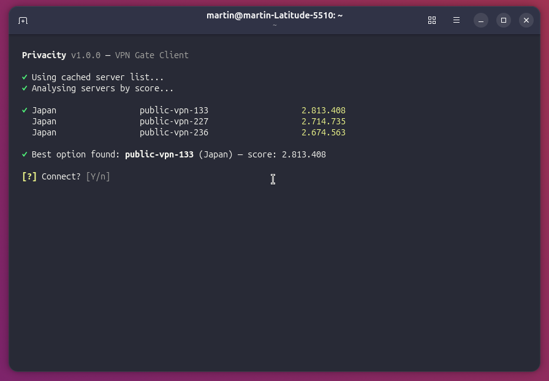

# privacity


[](LICENSE)

CLI tool that fetches the fastest public [VPN Gate](https://www.vpngate.net/) servers and connects via OpenVPN — interactive or daemon mode.



## Features

- 🔒 Sanitizes OpenVPN configs (strips `script-security`, `up`, `down`, `persist-key`, etc.)
- 🌐 Internet health check after connect (DNS + HTTP connectivity)
- ⚡ Download + upload speed test
- 🔔 Desktop notifications on connect/disconnect/fail
- 🗂️ Multi-profile: `privacity --profile work daemon`
- 📝 Log to file with `--log-file <path>` + `--verbose` timestamps
- 🌍 Country filter: `privacity -c Japan daemon`
- ⚙️ Config file: `~/.config/privacity/config` (country, mode)
- 💤 Systemd persist: `privacity daemon --persist`
- 🧪 24 bats tests — `shellcheck` clean (0 warnings)

## Quick start

```bash
git clone https://github.com/marelizal/privacity.git
cd privacity
sudo make install
sudo make completions
privacity
```

## Install

```bash
sudo make install          # /usr/local/bin/ + man page + lib/
sudo make completions      # bash/zsh completion
make hooks                 # pre-commit (shellcheck + bats)
```

## Usage

```bash
privacity                        # Interactive guided mode
privacity daemon                 # Connect in background (no terminal)
privacity disconnect             # Tear down current VPN
privacity reconnect              # Pick best server and reconnect
privacity status                 # Show connection info and live speed
privacity speedtest              # Download + upload speed test
privacity update                 # Pull latest version and reinstall
privacity list                   # Show top 10 servers + available countries
privacity help                   # Show help

# Options (place before command)
privacity -c Japan daemon          # Filter by country
privacity --profile work daemon    # Isolated config + data per profile
privacity --log-file /tmp/vpn.log daemon
privacity --verbose daemon
privacity daemon --persist         # Install systemd user service
privacity daemon --unpersist       # Remove systemd user service
```

## Config file

`~/.config/privacity/config` — simple `KEY=VALUE` format:

```
# Preferred country (any VPN Gate country name)
country = Japan

# Default mode (daemon or interactive)
mode = daemon
```

CLI flags override config values. Per-profile configs via `--profile`:
`~/.config/privacity/<profile>.config`

## Requirements

| Runtime | Dev / testing |
|---|---|
| `openvpn`, `wget`, `curl` | `shellcheck`, `bats` |
| `base64` (coreutils), `sudo` | `python3` (CSV parsing) |
| `notify-send` (optional) | — |

## How it works

1. Downloads server list from VPN Gate (HTTPS, fallback HTTP)
2. Parses CSV with python3 `csv` module — handles quoted commas in country names
3. Selects highest-score server (optionally filtered by country)
4. Decodes Base64 OpenVPN config, strips dangerous directives
5. Connects via OpenVPN with `--cd "$DIR"` and `chmod 700` on data dir
6. Verifies internet: DNS (`google.com` via `8.8.8.8`) + HTTP (204 check)
7. Measures download speed via Cloudflare, upload speed via nghttp2
8. Interactive mode: live RX/TX speed, IP, ping, location
9. Press `Q` to disconnect, `S` to switch server

## Directory layout

```
~/.local/share/privacity/
  servers.csv       Cached server list (5 min TTL)
  active.ovpn       Sanitized OpenVPN config
  privacity.pid     PID of background OpenVPN
  last_host         Last connected server hostname
  openvpn.log       OpenVPN daemon log
```

Per-profile data lives in `~/.local/share/privacity/<profile>/`

## Development

```bash
# Syntax & lint
bash -n privacity lib/*.sh
shellcheck -S warning -s bash privacity lib/*.sh

# Tests
sudo apt install bats
bats tests/*.bats

# Standalone tools (for debugging)
./lib/net.sh check
./lib/speed.sh

# Pre-commit hook (auto-runs on git commit)
make hooks
```

## License

GPL v3 — see [LICENSE](LICENSE)
